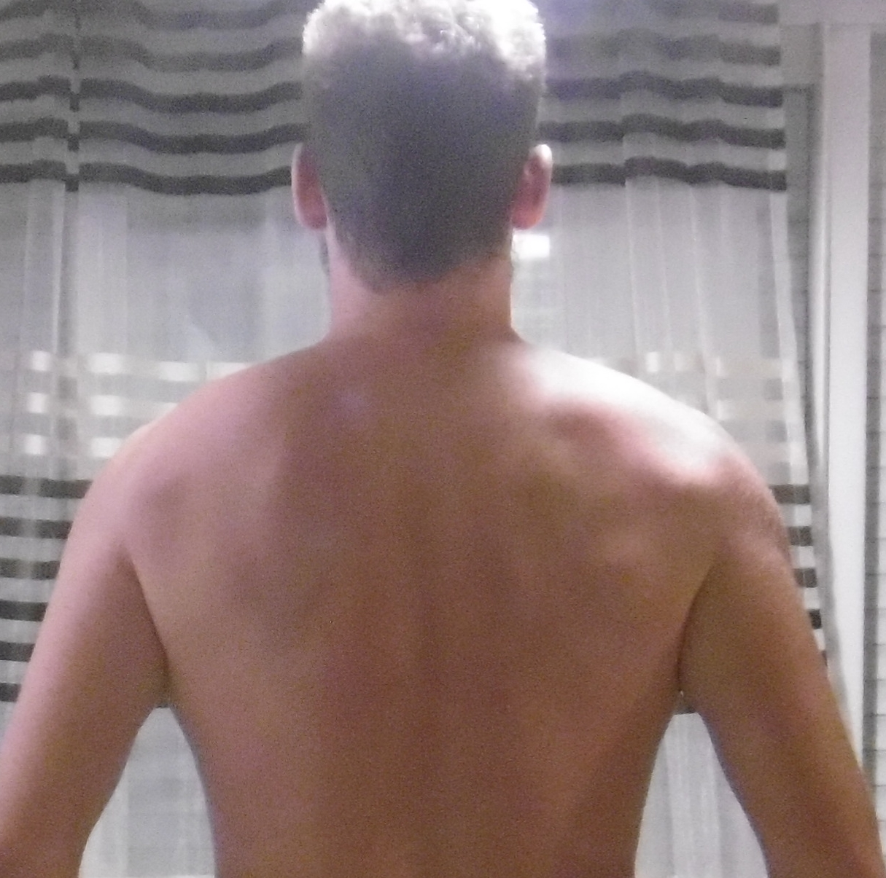
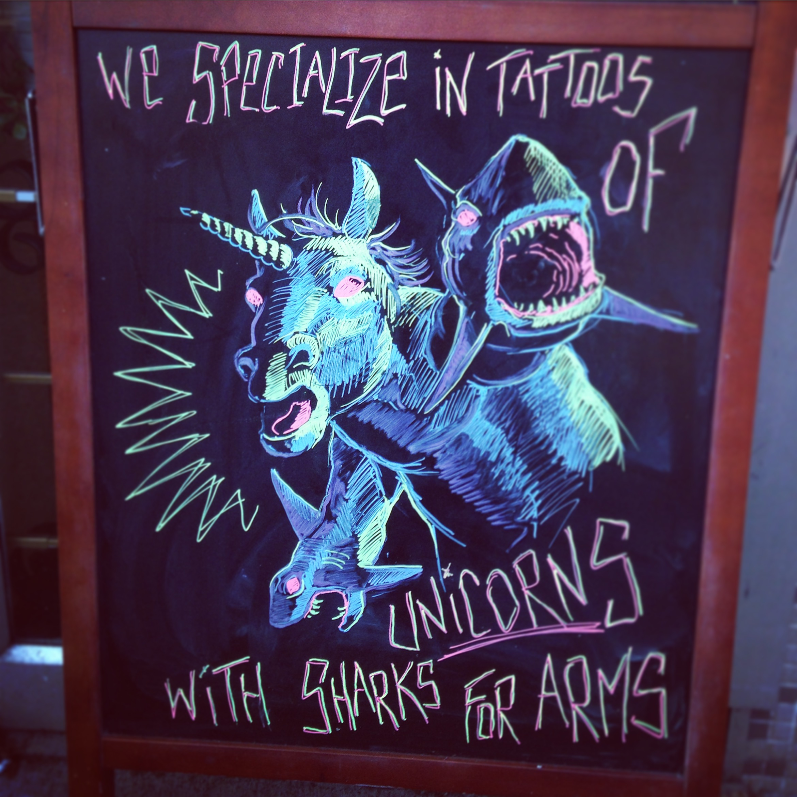

# Krita+G'MIC Tutorials

## General introduction

Krita Krita is a raster graphics editor based on Qt 5 and the KDE Frameworks 5. Krita is designed to be a digital painting application distributed under the GPLv2 license.
G'MIC is a full-featured open-source framework for image processing, distributed under the CeCILL license.
By combining these two, you can get a nice alternative to PhotoShop, even if it gets less fully automatized tools, you can do everything with a quite userfriendly and complete interface.
I'll introduce here the various (only one for now) works I did with this tool set.

## Fake tattoo on the back

### Introduction

This tutorial describe how to use krita to make appears a tattoo on the skin. Useful to get a preview, or to do some stupid jokes. In this example we will start with two picture: the tattoo original image a a photo of a back:

 

### Isolating the draw from the background

This is the basics, one of the first thing we try when we want to play with pictures.
Select the contiguous selection tool (the magic wand) and try to select the background board and everything you want to remove. Do not forget to unselect the anti-aliasing option in the "tool options" tab.
Then push the "supr" key, a checkerboard should appear. It represents the alpha layer which figure transparency in the current layer.
Remove everything useless until you have a picture similar to the shown one below.

### Putting it black and white

There are a lot of tools to make this draw black and white, and the example here might not be applyable to every draw. But G'MIC offer so many possibilities that you should find out the best for you.
First of all you have to select only the draw you want to put black and white (some tools turn the alpha layer to black or white). The easiest way to do it is to select the alpha layer background with the magic wander, then menu->invert selection.
The tool I generally use, and that always gave me satisfaction for this kind of work, is in the G'MIC menu->Colors->Metallic look. Play with the strength and smoothness to get a satisfying result. For the example I used strength=0 and smoothness=0.

### Underlying the contours

To do a tattoo, first of all the artist does the contour, then he fills it up. In the current result we have a quite thin (even unexisting) contour. So we will improve it a bit. First of all create a new layer on the bottom right. Then Select the Layer 1. With the magic wander, select the background then invert the selection. Then grow it by few pixels: menu Select->Grow Selection.
Then select the Layer 2 and fill the selection in white with the fill tool. You have to select the "Fill entire selection" in the Tool Options.

Return to the Layer 1 and select again the draw (select the alpha, invert selection), go back in the Layer 2 and suppress the selection. You should have only the contour.
Select the darkest point in the draw with the Color Selector Tool and fill the new contour with it.
It's better, but this contour is too distinct. We have to blur it a bit. Select it again, grow the selection by few pixels (the order of magnitude of the overall natural draw blur), then menu Filter->Blur->Gaussian blur, and select about the half of the selection grow done before. Repeat the operation until you get a satifying result. When finished, select the both layers, right clic and Merge with layer below.

### Add transparency

Now we need that this draw seems directly applied on the skin. The tattoo is done with dark ink, so the white is the skin. Menu Filter->Colors->Color to alpha. Select the color that is the lighter (the color selection tool can help) and the threshold that makes the dark part a bit transparent. And validate.

### Add the red skin effect

To make it seems that you just did it we will add some redskin effects.
Right clic on Layer 1 and duplicate the layer. Select the Copy of Layer 1, menu Filter->Adjust->Color Balance, increase the Red and decrease the other colors for the shadows and midtones to get a dark red color. Then blur it for some pixels (20 to 40 in the example). Then adjust the two layers opacity to get some tending to the red.
Duplicate again the Layer 1. Select the draw (select the alpha then invert the selection). Grow the size by several pixels (50 pixels in the example) and fill it with a dark red (dry blood color). Then blur it a couple of time (100 pixel in this example). To finish adjust the different layers opacity to get a satifying result (for the next step, if you find out that it's too dark or ligh, you can go back and adjust it again).

### Apply the tattoo on the skin

Almost there!!
Open the photo in which there is the skin surface to apply the tattoo. Copy the three layers tatto and past them on the back photo. Then Merge the three layers (select them, right clic, merge).
Adjust the size and position of the new merged layer thanks to the Move Tool and Transform tools (keep the shift key to keep the scaling proportionnal).

The very last and important steps before the "post-production", is to adjust the draw surface to the skin surface. To do so, select the draw with a rectangle and use the Transform a Layer or a Selection tool. First of all you have to apply the perspective. Select Perspective in the Tool Options tab. In the example there's almost nothing to do, but the principle is to have the same perspective as the skin applied to the draw.
Then the next step is to have a draw that follow the skin shape. Always in the transform tool, select Wrap in the Tool options. Then increase the subdivide to get a precise transformation. In the example we wrap the draw to follow the backbone. Use it also to follow the shoulder shape and other. That's it! The next step is for the final picture production.

### Final picture production

Until this point we should not have blured or degraded the quality of the photo nor the draw. It should be kept for the very last step, with an as conservative as possible policy for the both layers.

First of all we need to get an harmonization between the original draw and photo blurs. To do so just zoom in to determine which one is the most blured, then select the other layer, menu Tools->Blur->Gaussian Blur and adjust to get the same blur level.
Then if the photo has some noisy pixels, select the draw layer, then only the draw itself,  menu->Filter->Other->Random Noise and adjust to get the same level as the photo (G'MIC get some nice tool to do an even thiner work).
Finally export the picture. Export it in JPG and put the quality at the limit to degrade the photo, it will degrade the draw to make it even more naturally integrated.

That's it!